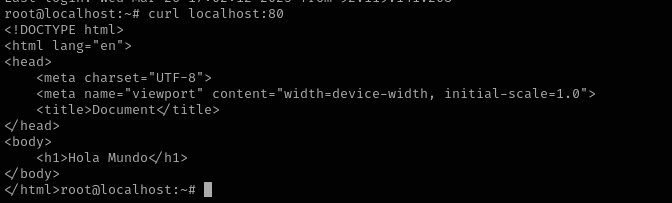
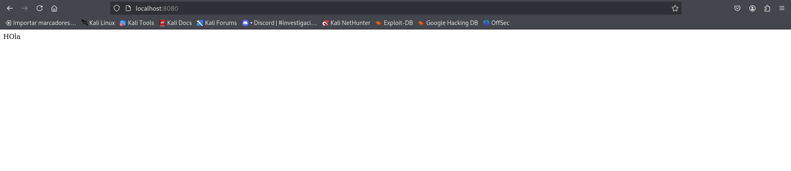
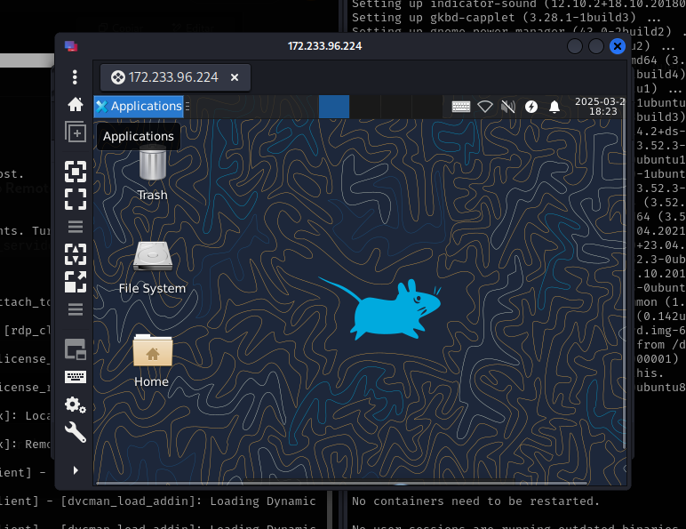

# Ejercicios tuneles SSH

Para algunos de estos ejercicios necesitareis configurar en vuestro SSH la siguiente opcion:

## Ejercicio 1: Exponer un servicio local en remoto

Utiliza un tunel para exponer un servicio que está funcionando en tu máquina local a través del VPS. Por ejemplo, un servidor web que esté escuchando en el puerto 8000 de tu máquina local.

1. Ponemos en el archivo nano /etc/ssh/sshd_config

```plaintext
GatewayPorts yes
```

2. Ponemos en el hosts y servicio a correr en el puerto 8000
```bash
python3 -m http.server 8000
```

3. En el VPS habilitamos en los puertos 22 y 80

```bash
ufw enable
ufw allow 22
mufw allow 80
```

4. En el host redirigimos el servicio con este tunel

```bash
 ssh -R 80:localhost:8000 root@172.233.96.224
```



## Ejercicio 2: Traer un servicio público a tu local

Trae un servidor web a tu máquina local a través de un tunel SSH. Por ejemplo, un servidor web que esté escuchando en el puerto 80 de tu VPS.

1. Ponemos un servicio a correr en el VPS.

```bash
python3 -m http.server 80
```

2. En el hosts redirigimos el servicio con el tunel 

```bash
ssh -L 8080:localhost:80 root@172.233.96.224
```



## Ejercicio 3: Remote Desktop a través de tunel SSH

En esta práctica necesitarás un VPS publico y un VPS privado, ambos conectados a una red VNC.

Lanza un servicio de escritorio remoto en el VPS privado y utiliza un tunel SSH para acceder a él desde tu máquina local. 

1. VPS publico instalamos "squid" y "xrdp"

2. VPS privado ponemos a correr un servicio 

```bash
python3 -m http.server 80
```
3. Accedemos a VPS Público con el hosts por "remmina"



4. Entramos en el cmd de l escritorio remoto

IMAGEN 3

```bash
ssh -L 8080:localhost:80 root@10.0.0.11
```

## Ejercicio 4: Acceso privado tras NAT

Queremos poder acceder a un dispositivo que está en nuestra clase. Crea un tunel que nos permita accederlo desde el VPS cuando estemos en casa.

## Ejercicio 5: Logs remotos

Utiliza un tunel remoto para enviar logs a tu VPS mediante netcat.

1. Ponemos en el archivo nano /etc/ssh/sshd_config

```plaintext
GatewayPorts yes
```

2. En el VPS habilitamos en los puertos 22 y 80

```bash
ufw enable
ufw allow 22
```

3. Ponemos a correr el servicio de logs

```bash
nc -l -p 12345 > /logs.txt
```
4. En el hosts redirigimos el arhcivo de los logs a netcat de escucha

```bash
ssh -L 20023:localhost:12345 root@172.233.96.224
cat /var/log/syslog | nc localhost 20023
```